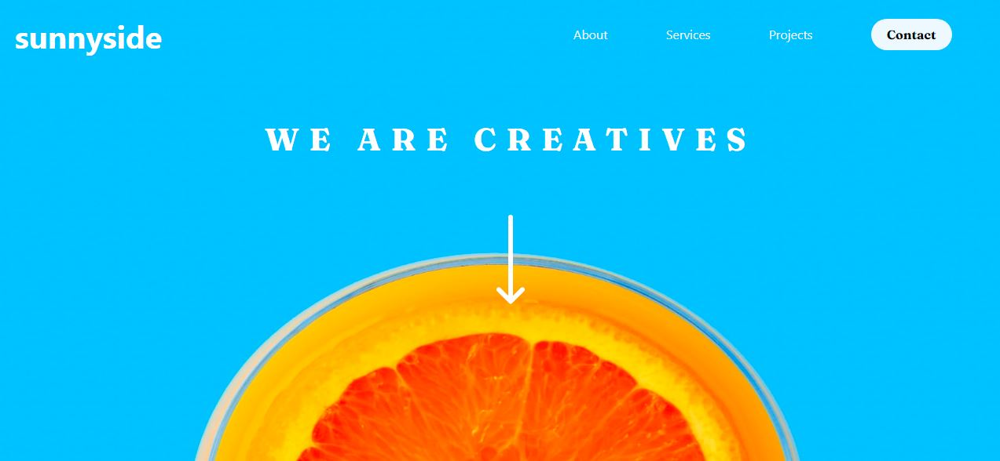

# Frontend Mentor - Sunnyside agency landing page solution

This is a solution to the [Sunnyside agency landing page challenge on Frontend Mentor](https://www.frontendmentor.io/challenges/sunnyside-agency-landing-page-7yVs3B6ef). Frontend Mentor challenges help you improve your coding skills by building realistic projects.

## Table of contents

- [Frontend Mentor - Sunnyside agency landing page solution](#frontend-mentor---sunnyside-agency-landing-page-solution)
  - [Table of contents](#table-of-contents)
  - [Overview](#overview)
    - [The challenge](#the-challenge)
    - [Screenshot](#screenshot)
    - [Links](#links)
  - [My process](#my-process)
    - [Built with](#built-with)
    - [Continued development](#continued-development)
    - [Useful resources](#useful-resources)
  - [Author](#author)
  - [Acknowledgments](#acknowledgments)

## Overview

### The challenge

Users should be able to:

- View the optimal layout for the site depending on their device's screen size
- See hover states for all interactive elements on the page

### Screenshot

### Links

- Solution URL: [Repository](https://github.com/RPinero-20/sunnyside-agency-landing-page-bootstrapped)
- Live Site URL: [Live](https://rpinero-20.github.io/sunnyside-agency-landing-page-bootstrapped/)

## My process

### Built with

- HTML
- CSS
- [Bootstrap 4.16](https://getbootstrap.com/docs/4.6/getting-started/introduction/)
- JS

### Continued development

I try to improve skills using Bootstrap.

### Useful resources

- [W3School](https://www.w3schools.com/default.asp)

## Author

- Website - [Raul Pinero @raulfix](https://raulfix-developer.herokuapp.com/)

- Frontend Mentor - [@RPinero-20](https://www.frontendmentor.io/profile/RPinero-20)

## Acknowledgments

Flexible minds learn to learn.
